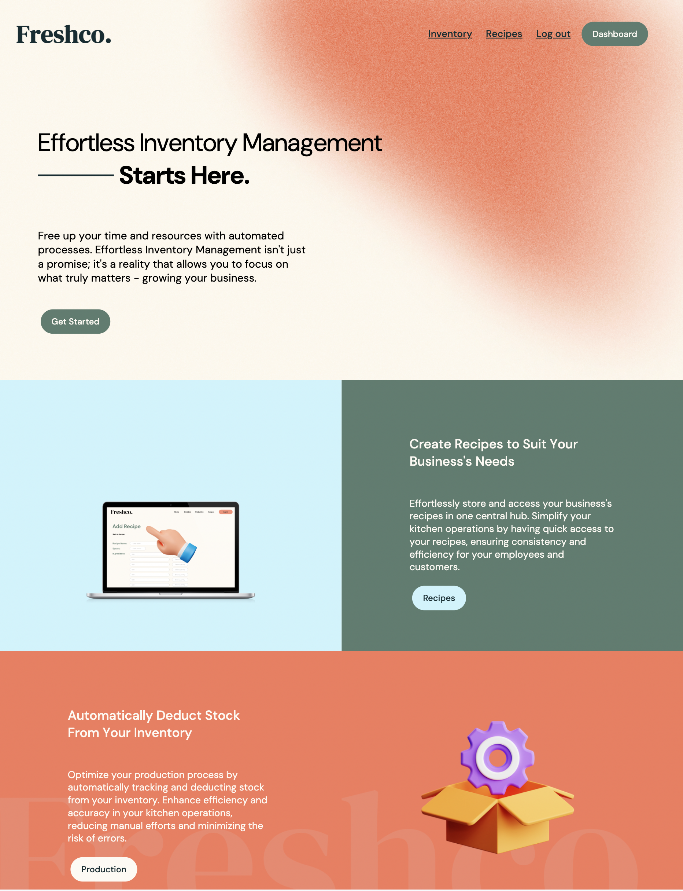
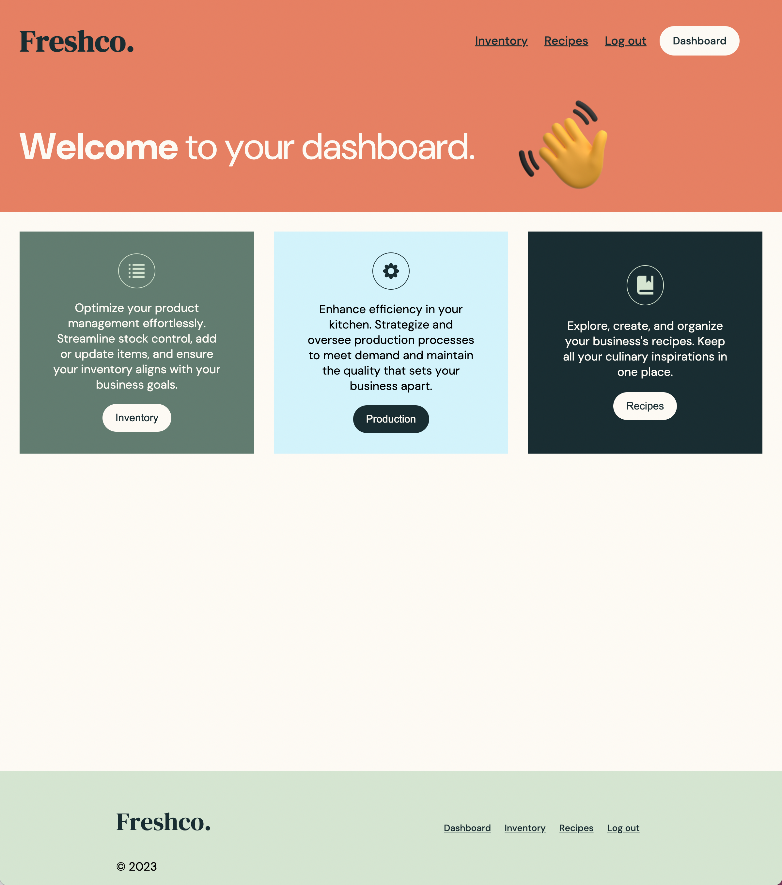
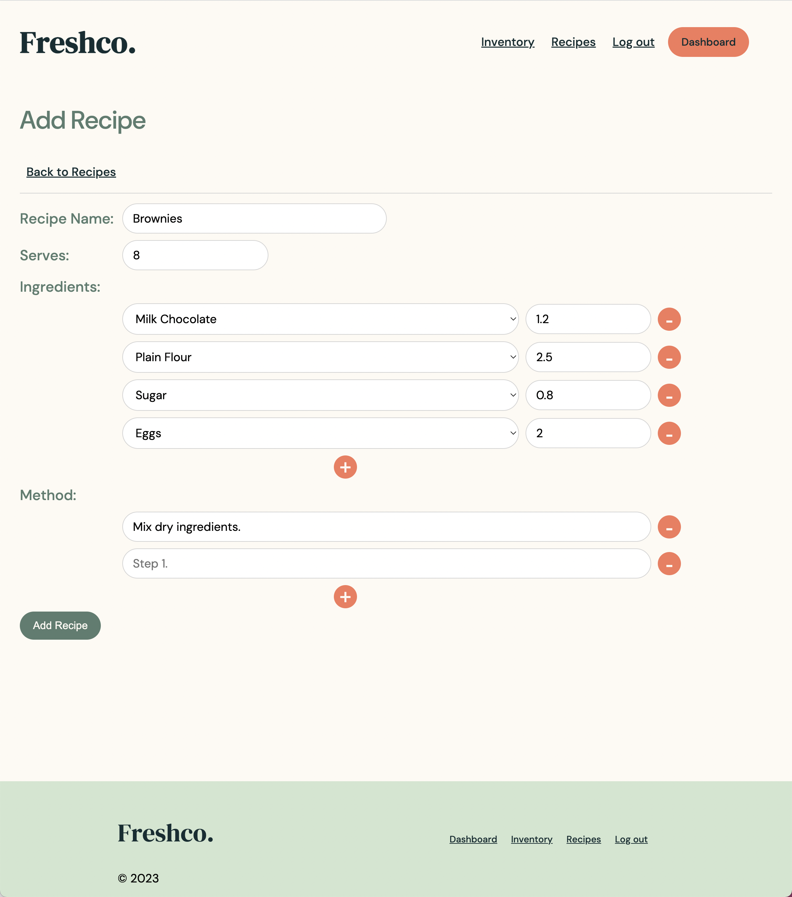

# 🌱 Freshco.

### Description:

Freshco. is an Inventory and Recipe Management web application designed with small businesses in mind. Users can manage their inventory, create recipes, and track food productions.

### [Link to Freshco.](https://freshco.onrender.com/)

### [Link to Trello Board](https://trello.com/b/1Ybj64jn/project-2-freshco)

## 🏃‍♀️ Getting Started

1. Login via Google
2. Add items to your inventory by entering their name, SKU, and initial quantity
3. Use items in your inventory to recreate your business's recipes
4. Track productions by entering the recipe name, units/serves made, and batch numbers of inventory items
5. Your recipes, productions, and items in your inventory are completely editable and can be deleted.

## 📷 Screenshots

**Landing page:**

**Dashboard:**

**Add recipe page:**

## 💾 Technologies Used

-   MongoDB
-   Mongoose
-   Express.js
-   Node.js
-   EJS for templating
-   HTML and CSS for frontend styling

## 🚀 Next Steps

-   Allow users to add information about the item cost per kg/L, and supplier information
-   Categorise recipes and inventory items by type, category, and supplier
-   Enable users to set a low-stock threshold for each item, and display the item in red/bold when the stock levels fall below a certain quantity
-   Provide a history of movement (additions, deductions, and adjustments) for each item in the inventory
-   Track each batch of a food item that is received
